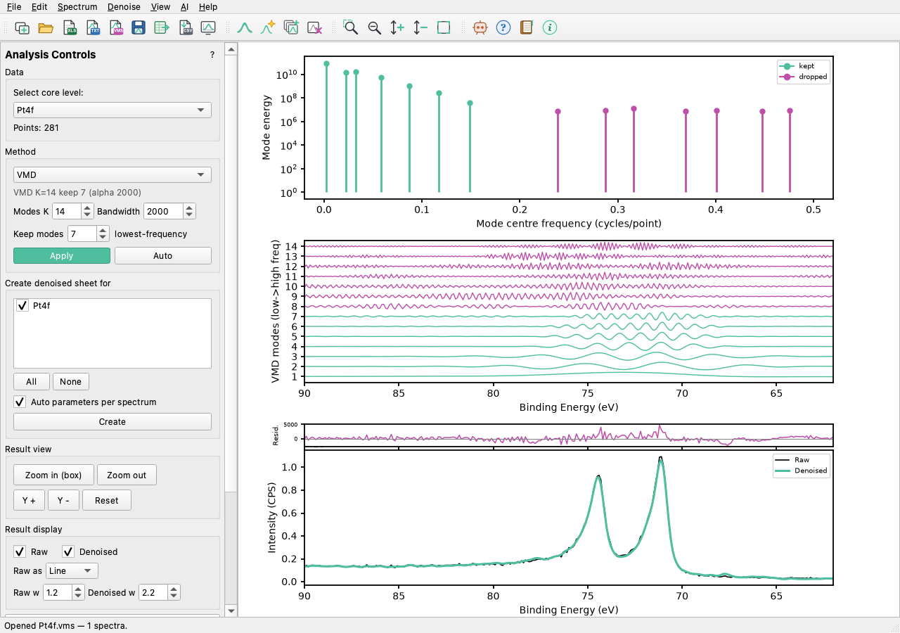

# KherveNoise

**Spectral denoising for spectroscopy — VMD, wavelet and FFT — with no
training data.** KherveNoise is the *Spectral Denoising* tool of
[KherveFitting](https://github.com/KherveFitting/KherveFitting) as a
stand-alone desktop app: the same methods, controls, plots and numbers, for
any spectrum (XPS, Raman, FTIR, XAS, EELS…).



- **Three methods**, each with a view of what it keeps and what it drops:
  Variational Mode Decomposition, wavelet shrinkage (PyWavelets) and an FFT
  low-pass filter — plus an **Auto** rule that tunes each one to the
  spectrum's own noise floor.
- **Raw vs Denoised with a residual strip**, box zoom, line or scatter.
- **Batch create**: denoise many spectra at once, each auto-tuned; the
  originals are never changed.
- **Import** Excel (KherveFitting layout), **VAMAS** (.vms) and plain data
  files (.asc / .txt / .dat / .xy / .csv) — read exactly as KherveFitting
  reads them. Drag and drop works too.
- **Export** straight back to a **KherveFitting workbook**, to CSV / text,
  or the figure to PNG / SVG / PDF. Projects save as `.knoise`.
- **Claude-ready (MCP)**: *AI ▸ Connect to Claude* lets Claude Desktop,
  Claude Code, Cursor and others drive the window.
- Undo / redo, recent files, New Instance, a long how-to tooltip on every
  toolbar icon, an in-app User Guide (F1) and automatic updates from GitHub.

## Install and run

Python 3.12 or 3.13.

```bash
git clone https://github.com/gkerherve/KherveNoise.git
cd KherveNoise
python -m venv .venv
.venv/bin/pip install -r requirements.txt    # Windows: .venv\Scripts\pip
.venv/bin/python KherveNoise.py              # or: python -m khervenoise
```

A file given on the command line is opened: `python KherveNoise.py C1s.vms`.

## Tests

```bash
.venv/bin/python -m pytest tests -q
```

`tests/test_engine.py` checks the denoising maths against a verbatim copy of
KherveFitting's code (`tests/kf_reference.py`) — the results are
bit-for-bit identical.

## Methods and references

FFT: Cooley & Tukey, *Math. Comput.* 19, 297 (1965). Wavelet shrinkage:
Mallat, *IEEE TPAMI* 11, 674 (1989); Donoho & Johnstone, *Biometrika* 81,
425 (1994). VMD: Dragomiretskiy & Zosso, *IEEE Trans. Signal Process.* 62,
531 (2014). The full list is under *Help ▸ Methods & References*.

## Author and licence

Gwilherm Kerhervé, Department of Materials, Imperial College London —
part of the Kherve family of tools, [khervetools.com](https://khervetools.com).

Licensed under the GNU General Public License v3.0 (see `LICENSE`).
